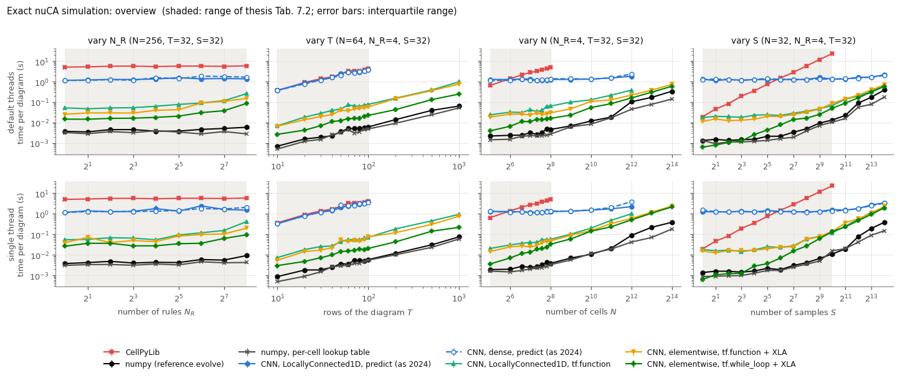
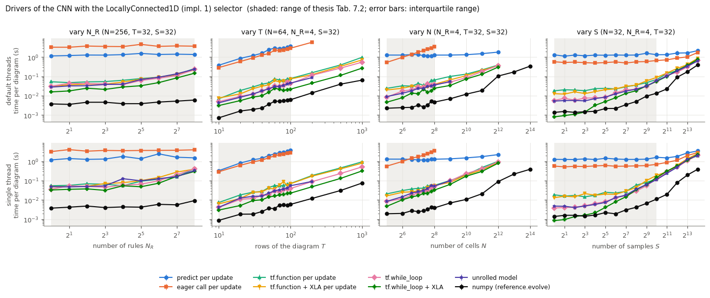
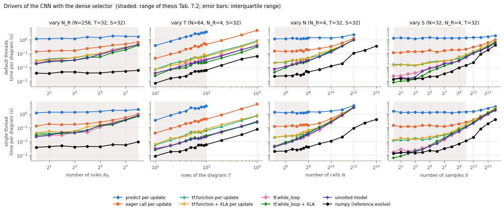
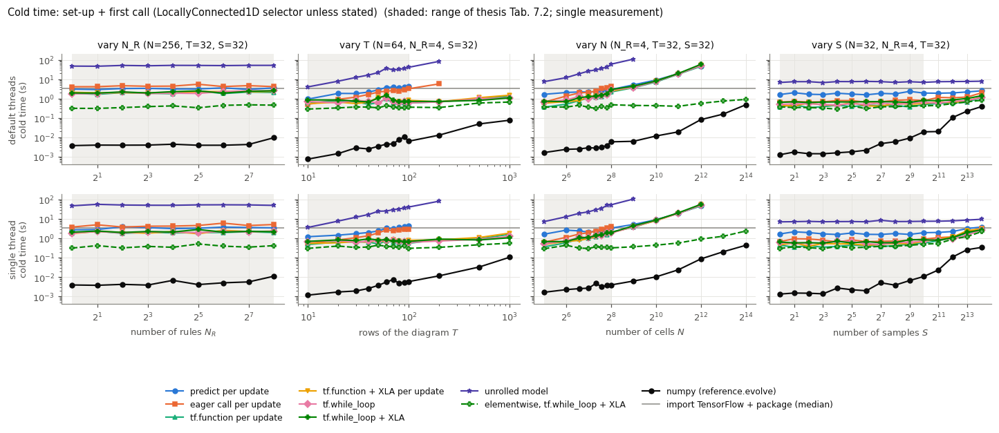
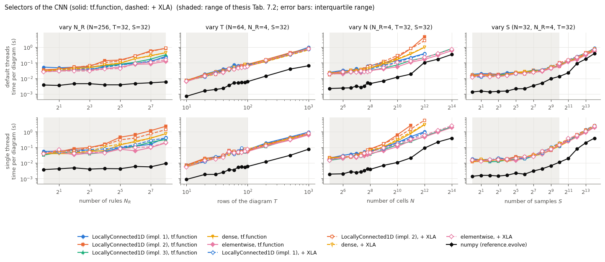

# How fast can exact nuCA emulation be? Benchmark report

> **Status: skeleton.** Methods, protocol and questions are final; every
> `[TO FILL]` awaits the full run on a quiet machine
> (`python experiments/benchmarks/run.py --all`, then `plot.py`). The numbers
> come from `results/full_summary.md` and the figures in `results/`.
> This report does not edit the thesis; Section 6 lists the thesis
> statements that the results will qualify.

## 1. Why a new benchmark

The ACRI 2024 paper (Fig. 5) and thesis Sec. 7.1.4 (Tab. 7.2) compare three
ways to simulate nuCAs: CellPyLib, a CNN with a `LocallyConnected1D`
selector, and a CNN with a dense selector. The CNNs were run with one
`model.predict` call per time step, and the timings covered one pass with
`time.time` (mean ± std of 10 repeats, model build excluded, first call
included). That protocol, reproduced by `scripts/benchmark_published.py`,
measures a particular way of using the networks. It does not measure how
fast exact emulation can be. The thesis draws two conclusions that go
beyond what was measured (Section 6).

This benchmark keeps the 2024 scenarios and adds:

- the ways of running a TensorFlow model that avoid per-call overhead;
- selectors that avoid the N_R N² dense kernel;
- plain numpy;
- a strict separation of one-off (cold) and steady-state (warm) costs;
- a thread-controlled comparison.

## 2. Questions

- **Q1 (overhead).** How much of the 2024 CNN time is per-call overhead of
  `model.predict`, rather than computation? What remains with `model(x)`, a
  `tf.function` step, XLA, a `tf.while_loop` or an unrolled model?
- **Q2 (fixed cost).** What does a user pay once, split into importing
  TensorFlow, building the model, and tracing or compiling on the first call?
  After how many diagrams does it amortise?
- **Q3 (selectors).** How do `LocallyConnected1D` (implementations 1, 2 and
  3), the dense selector and an elementwise selector scale with N and N_R?
  Where does the N_R N² memory of the dense selector (and of implementation
  2) stop it?
- **Q4 (numpy).** Does hand-vectorised numpy outperform CellPyLib and the
  CNNs, as the thesis states without having measured it? Over which ranges?
- **Q5 (best case).** What is the fastest exact method at each scenario
  point, and by what factor does it beat the 2024 protocol and CellPyLib?
- **Q6 (threads).** How much of each method's speed comes from using several
  cores? Are the rankings the same with a single thread?

## 3. Methods

Every method returns the complete spacetime diagram of S nuCAs (N cells, N_R
rules, static allocation, T rows = T - 1 updates, periodic boundaries). Each
must be bit-identical to `ca_emulators.reference.evolve` before its timing
counts. `tests/test_methods.py` checks all 36 methods on de Bruijn
certificate configurations: every cell meets all eight neighbourhoods, so
every cell's rule table is exercised in full. Each job checks again at its
own size.

| method | what is timed |
|---|---|
| `cellpylib` | `cpl.evolve` per sample, per-cell rule via `nks_rule`, `memoize=False` (`reference.evolve_cellpylib`) |
| `numpy` | `reference.evolve` (the package's vectorised reference; its speed depends on the package version, see the metadata's git commit) |
| `numpy_lut` | numpy with a precomputed per-cell lookup table: per update one neighbourhood index and one `np.take` (written for this benchmark) |
| `predict:<sel>` | `model.predict(x, batch_size=S)` per update, output fed back (2024 protocol, but one batch per call) |
| `eager:<sel>` | `model(x, training=False)` per update |
| `compiled:<sel>` | a `tf.function` of one update (`simulate.compiled_step`), traced once, called T - 1 times |
| `xla:<sel>` | the same with `jit_compile=True` |
| `while_loop:<sel>` | the whole diagram in one `tf.function` using `tf.while_loop` and a `TensorArray` |
| `while_loop_xla:<sel>` | the same with `jit_compile=True` |
| `unrolled:<sel>` | one call of a model with the T - 1 updates unrolled (`timesteps=T-1, output_hidden=True`), inside a `tf.function` |

Selectors: `lc1`/`lc2`/`lc3` = `LocallyConnected1D` with `implementation=1/2/3`
(`NucaEmulator.model()`; 1 is the 2024 network); `dense` =
`NucaEmulator.model_dense()`; `elem` = the N_R candidate channels
multiplied by the one-hot allocation (N, N_R) and summed over the rules
(plain TensorFlow ops; the detector and rule-table layers and their weights
are the package's). XLA cannot compile `lc3`.

## 4. Protocol

The settings of a full run are listed below; see README.md for the options.

- **Isolation.** Each (method, scenario point, thread setting) runs in its
  own Python subprocess (fresh TensorFlow runtime, no shared traces or
  caches).
- **Threads.**
  - `default`: library defaults (TensorFlow's own thread pools; numpy's
    elementwise operations are single-threaded anyway).
  - `single`: `tf.config.threading` intra = inter = 1, and
    `OMP/MKL/OPENBLAS_NUM_THREADS = 1`.
  - CellPyLib (pure Python) runs in the default setting only.
- **Cold.** Set-up + first call, measured once. It is reported with the
  import time (`import_s`: TensorFlow and `ca_emulators`, plus CellPyLib for
  `cellpylib`), which is excluded from cold.
- **Warm.** `time.perf_counter`, garbage collector off during a repeat. There
  are 10 repeats of `number` calls, where `number` (1, 2, 5, 10, ...) makes a
  repeat last at least 0.1 s. We report the median and the interquartile
  range per call.
- **Scenarios.** Tab. 7.2 (the *core* range: N_R 1-256; T 10-100; N 32-256;
  S 1-1024, with the 2024 fixed values), extended to T ≤ 1000, N ≤ 16384 and
  S ≤ 16384.
- **Budgets.**
  - Core points: 600 s warm and 600 s cold.
  - Extended points: 60 s warm and 120 s cold, and skipped when a linear
    extrapolation from the previous good point exceeds the budget.
  - After a failure (over budget, time-out, error, mismatch), the larger
    points of the chain are skipped.
  - Selector kernels above 512 MiB are skipped.
  - Every skip is recorded with its reason.
- **Data.** Rules drawn without replacement from 0-255 and sorted; uniform
  random allocation and initial states. The seed depends only on (N, N_R, T,
  S) and `BASE_SEED = 20240912`.
- **Recorded context.** Machine, software, git commit and dirty flag, CPU
  load before the run, and a calibration workload timed before and after
  (`results/benchmark_full_meta.json`).

**Differences from the 2024 protocol**, all deliberate:

- warm and cold are separated (2024 included the first `predict` call in
  the timed loop, but not the model build);
- `perf_counter` and median/IQR instead of `time.time` and mean ± std;
- `predict` gets `batch_size=S`, one batch per call (the Keras default of 32
  split S > 32 into several batches);
- the frames are collected in a list and stacked once, instead of
  `np.append` at every update;
- CellPyLib runs through `reference.evolve_cellpylib` (the same per-sample
  loop, rule looked up per cell).

## 5. Results

**Machine and session.** [TO FILL from `benchmark_full_meta.json`: CPU,
cores, RAM, power, OS, versions, git commit, CPU load before, calibration
before/after, duration, job status counts.]

### 5.1 Overview



[TO FILL: one paragraph per scenario. Fastest method in the core range and
in the extended range; factor between the 2024 protocol (`predict:lc1`,
`predict:dense`) and the fastest exact method; position of CellPyLib.]

### 5.2 Where the 2024 CNN time goes (Q1)




[TO FILL from summary tables A and B:

- warm time per update of `predict`, `eager`, `compiled`, `xla` at the
  smallest case (overhead-dominated), per selector;
- ratio `predict` / `compiled` and `predict` / `while_loop_xla` in the core
  range;
- whether the `predict` time is flat in N, N_R and S (overhead) and linear
  in T.]

### 5.3 One-off costs (Q2)



[TO FILL from summary table A:

- import time;
- build time;
- first-call time (trace, XLA compile) per driver;
- cold − warm = the true one-off cost;
- number of diagrams after which a compiled or XLA driver beats `predict`
  and numpy, including its cold cost;
- growth of the unrolled model's cold time with T.]

### 5.4 Selectors (Q3)



[TO FILL:

- scaling with N and N_R of `lc1` (graph with N slices), `lc2` (masked
  N_R N² kernel), `lc3` (sparse), `dense` (N_R N²) and `elem` (N_R N);
- the largest N reached by each, with the memory skips;
- the peak memory (`peak_memory_mb`).]

### 5.5 numpy against CellPyLib and the CNNs (Q4, Q5)

[TO FILL from summary table C:

- number of points where `numpy` (and `numpy_lut`) is faster than the
  fastest exact CNN, per scenario and thread setting;
- the range of the ratio;
- where, if anywhere, a CNN wins (large S? large N with XLA?);
- `numpy` vs `cellpylib` speed-up.]

### 5.6 Threads (Q6)

[TO FILL: default vs single thread for each family; which rankings change.]

## 6. Thesis statements this benchmark qualifies

The thesis is not edited here. The statements are quoted as the task
describes them, to be checked against the text of Sec. 7.1.4 before any
revision.

**S1: the CNNs carry a "fixed cost of a few seconds".**

What the 2024 timing arrays (`data/benchmarks_2024/`) already show:

- **The cost is proportional to T, not fixed.** In the T scenario (N = 64,
  S = 32) the CNN time grows linearly with the number of updates:
  - 51 ms per update with a near-zero intercept (0.06 s) for the dense
    selector;
  - 48 ms per update plus 0.6 s for the locally connected one.

  It is flat in N, N_R and S only because those scenarios kept T = 32
  (31 `predict` calls).
- **It depends on the session.** The same configuration (N = 256, N_R = 4,
  T = 32, S = 32) was measured in two scenarios:

  | selector | N_R scenario | N scenario |
  |---|---|---|
  | dense | 1.51 s | 3.58 s |
  | locally connected | 3.44 s | 6.51 s |
  | CellPyLib | 5.82 s | 8.90 s |

  At S = 1 (N = 32) the CNN costs 126-142 ms per update, against about
  50 ms in the T scenario.

  The CNN baseline therefore varied by a factor of 1.5-2.5 between sessions.

The new benchmark measures the parts directly: import, build, first call,
and warm time per update for each driver.

[TO FILL: the measured decomposition, and a proposed rewording of S1, for
example: "The CNN timings of Fig. 5 are dominated by a per-update overhead
of `model.predict` of about ... ms, not by computation; with a compiled
update the same networks need ... per update, after a one-off cost of ...
s."]

**S2: "hand-vectorised numpy code would outperform both" (untested in the
thesis).** `numpy` (the package's reference) and `numpy_lut` measure this
directly, against CellPyLib and against every CNN variant, not just the two
of 2024.

[TO FILL: confirmed, refuted or qualified, per scenario range and thread
setting, with the factors. Also whether the claim still holds against the
fastest CNN (XLA, while loop, elementwise selector), and a proposed
rewording.]

## 7. Limitations

- **One machine.** A laptop (i7-9850H, Windows, CPU only), the same one as
  in 2024; turbo and thermals make single-thread and multi-thread results
  hard to compare. No GPU.
- **One software stack.** TensorFlow 2.14 and Keras 2 (the versions of the
  paper); Keras 3 dropped `LocallyConnected1D`.
- **Budgets.** The extended ranges are cut by budgets, so absent points mean
  "too slow or too large under this protocol", not "impossible". Linear
  extrapolation can skip a point that would have fitted, if a method scales
  sublinearly.
- **Methods written here.** `numpy_lut` and the elementwise selector were
  written for this benchmark. Neither is optimal (Numba, bit packing, or a
  gather-based TF step would be faster); they are an attainable baseline.
- **The `numpy` baseline moves with the package.** It is the package's
  `reference.evolve`, whose implementation changed during the v1 clean-up
  (rule tables now computed once per diagram, not once per update).
- **Scope.** Static allocations only; ECAs and time-varying allocations are
  not covered.

## 8. Reproduction

```bash
python -m pytest experiments/benchmarks/tests
python experiments/benchmarks/run.py --all         # results/benchmark_full.csv (+ _meta.json)
python experiments/benchmarks/plot.py              # figures + results/full_summary.md
```

[TO FILL: date of the run, duration, git commit.]
