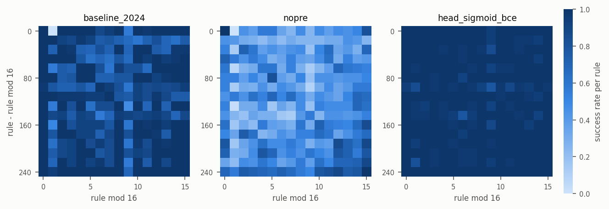
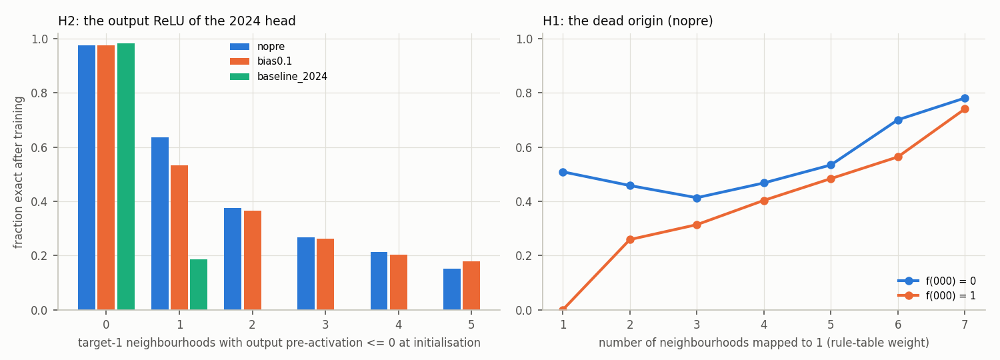
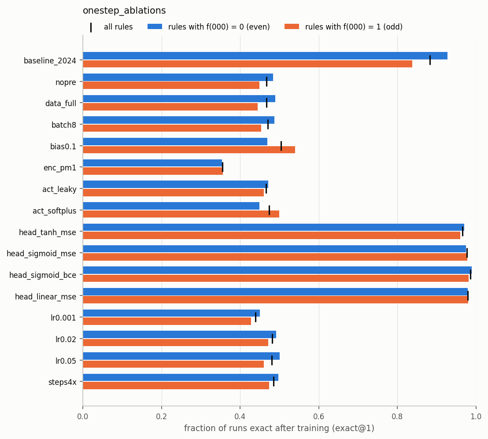
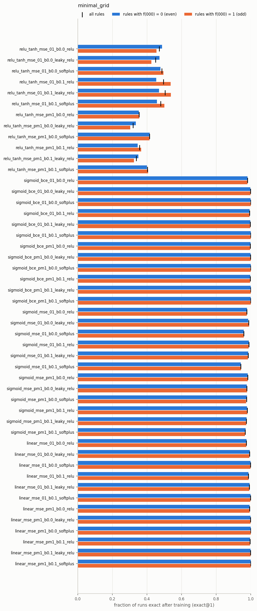
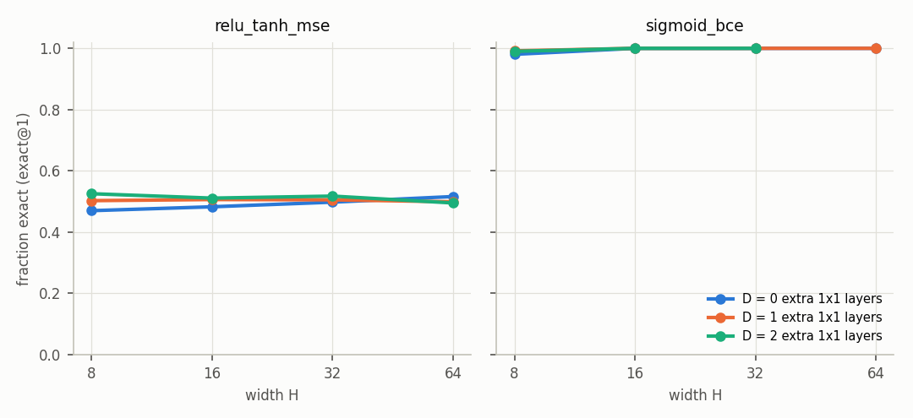
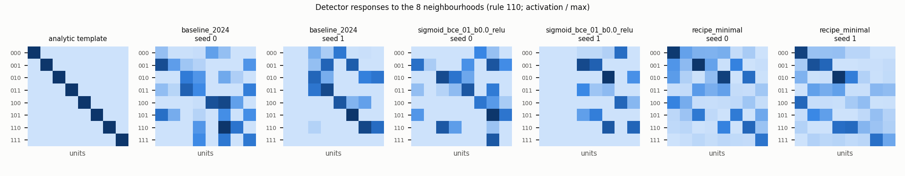
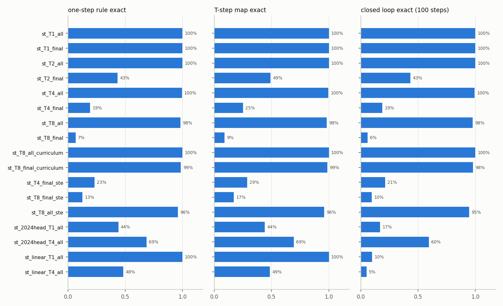

# Training ECA emulators reliably: report

Study of how to train, from random weights, a small CNN that emulates an elementary cellular automaton (ECA) **exactly**, for all 256 rules and (nearly) every seed. Everything below was run on the laptop CPU (i7-9850H) on 29 September 2026. Every number comes from `results/` (summaries) or `results/raw/` (one CSV row per trained network; gitignored). No seeds were selected or discarded: each configuration was trained on all listed rules × all listed seeds, and every run counts. Sweeps left for the workstation are marked **[workstation]** with their commands (section 6).

## Summary

- **The 2024 recipe works in 88.3% of runs** (all 256 rules × 32 seeds; 95% CI 87.6–89.0%) and never for rule 1 (0/32). Without its pretraining loop it works in **46.7%**. Only 54% of its exact networks stay exact when iterated without binarisation. A cross-check with the real Keras `train_2024_recipe` agrees rule by rule.
- **The main cause is the output head, not the dead origin (H2 > H1).** The 2024 rule-table layer applies a ReLU before the tanh. Every neighbourhood with target 1 whose output pre-activation starts ≤ 0 gets no gradient.
  - 85% of initialisations start with at least one such "stuck" neighbourhood.
  - Success is 97.6% with none stuck, and 64%, 38%, 27%, 21% and 15% with 1–5 stuck.
  - Width and depth do not help: 47–52% for every H ≤ 64 and D ≤ 2.
- **The dead origin (H1) is real but narrow.** With {0,1} inputs and zero biases, the gradient at neighbourhood 000 is exactly zero in 100% of initialisations.
  - This makes rule 1 unlearnable.
  - It makes the 2024 pretraining loop **never terminate for rule 1**: every candidate's loss is at least about 1/8, above the 0.1 threshold.
  - It costs odd rules with few 1s (two 1s: 26% vs 46% for even rules).
  - Over all rules, odd and even succeed about equally (44.9% vs 48.4%).
- **The fix is a sigmoid output with binary cross-entropy (BCE), plus a non-dying hidden unit.**
  - Replacing only the head gives 98.3–98.5%.
  - With ±1 inputs and softplus units (still 41 parameters), Adam at learning rate 0.02 gives **32768/32768 exact runs (all 256 rules × 128 seeds)**, at most 576 steps to exactness.
  - Every one of those networks is *proved* exact in unbinarised closed loop, forever, by an interval certificate.
  - The recipe is insensitive to the data: full batch, 1 or 64 random configurations per step all give 100%.
- **Nothing else rescues the 2024 head.** Encoding, bias, activation, learning rate, batch, full-batch data, 4× more steps, width 64 and depth 2 each leave it at 32–52%.
- **Wide networks:** with the sigmoid/BCE head, every H ≥ 16 gave 100% (up to H = 64, D = 2 where run), even with the other 2024 choices (ReLU, {0,1} inputs, zero bias, learning rate 0.005).
- **Templates are never recovered.** Of 743,580 exact minimal networks, 0 have the analytic one-hot detector layer up to permutation; gradient descent finds distributed codes.
- **Spacetime diagrams:**
  - Loss on all frames works: one-step exact in 100%, 100%, 99.6% and 98.3% of runs for T = 1, 2, 4 and 8.
  - Final frame only fails: 43% (T=2), 19% (T=4) and 6.8% (T=8).
  - A curriculum over T fixes it: 98.7% at T=8 with the final frame only.
  - Straight-through binarisation helps little.
  - BPTT helps the 2024 head (44% → 69% at T=4) and harms a linear head.

## 1. Questions

1. Why does the 2024 recipe fail? Is the "dead origin" (H1) responsible, or the output head and minimal width (H2)?
2. Which changes make training reliable, i.e. exact for every rule in (nearly) every seed? For the minimal architecture, and for wider or deeper networks?
3. Do trained minimal networks recover the analytic templates?
4. Can emulators be learnt from multi-step spacetime diagrams (T > 1, backpropagation through time), and does that help closed-loop behaviour?

## 2. Set-up

**Networks.** Every network has receptive field 3:
- periodic padding;
- one width-3 convolution with H channels (the "detectors");
- D optional 1×1 hidden layers of width H;
- a 1×1 convolution to one logit (the "rule table").

H = 8, D = 0 is the ACRI 2024 architecture. Trained, its rule-table layer carries a bias, so it has 41 parameters (the analytic emulator has 40). Kernels are He-normal; hidden biases start at `bias_init` and the output bias at 0.

| factor | values |
|---|---|
| input encoding | states as {0,1} (2024) or {−1,+1} |
| hidden activation | ReLU (2024), leaky ReLU (slope 0.1), softplus |
| bias initialisation | 0 (2024) or 0.1 |
| output head and loss | `relu_tanh_mse` (2024: ReLU on the rule-table layer, then tanh, MSE); `tanh_mse`; `sigmoid_mse`; `sigmoid_bce` (linear logit, sigmoid, BCE from logits); `linear_mse` |
| width, depth | H ∈ {4, 6, 8, 16, 32, 64}, D ∈ {0, 1, 2} |
| optimiser | Adam; learning rate 0.001–0.1 (2024: 0.005); 320–10240 steps (2024: 40 epochs × 64 batches = 2560) |
| data | per step, B random configurations of 32 cells (2024: B = 64; also 1, 8), or the 8 neighbourhoods as one full batch |
| 2024 pretraining | on/off. Re-initialise, train one epoch (32 batches of 128), keep the first network whose epoch loss is < 0.1, else the best; capped here at 32 candidates |
| spacetime | T ∈ {1, 2, 4, 8} unrolled updates (BPTT); loss on all frames or the final frame; curriculum over T; straight-through binarisation |

**Engine (`ensemble.py`).**
- **Ensembles.** Thousands of independent networks train at once. Weights carry a leading member axis, the loss is the sum of the members' mean losses, and a Keras-identical Adam acts elementwise. Each member's initialisation and data come from `SeedSequence([2024, rule, seed, crc32(config name)])`, independent of grouping.
- **Tests.** One member follows exactly the trajectory of a standalone Keras network with the same weights, checked for three architectures. The default configuration *is* `EcaEmulator(N, activation="tanh")`.
- **One-step training is an 8-example problem.** A network with receptive field 3 sees a configuration only through its neighbourhoods. The mean loss over the B × N cells of a batch therefore equals the loss on the 8 neighbourhoods, weighted by their frequencies in the batch (tested). One-step training thus runs on the 8 patterns, weighted like a random batch from a pool of 65536 or uniformly. A batch of random configurations only reweights the 8 neighbourhoods, so failures cannot be due to missing data.
- **Cost.** About 40–70 CPU-seconds per 1000 minimal networks, including all evaluation. A Keras run of the 2024 recipe took about 130 s.

**Metrics (per network).**
- **exact:** the thresholded one-step output is right on all 8 neighbourhoods, equivalently on the de Bruijn configuration 00010111. With binarisation between steps, this implies exact emulation of every configuration for any number of steps. The headline is the fraction of runs exact at the end of training, with 95% Wilson intervals.
- **closed loop:** 100 steps **without** binarisation from 8 configurations of 32 cells (one of them the tiled de Bruijn sequence), compared with `ca_emulators.reference` after thresholding.
- **certificate:** interval bound propagation proves, for some ε ∈ {0.01, …, 0.45}, that every input within ε of a binary neighbourhood is mapped within ε of the correct state. The unbinarised iteration then stays exact for every configuration, of any size, forever. This is sufficient but not necessary.
- Also recorded: margin, step of first exactness and its persistence, dead units, "stuck" output neighbourhoods, the gradient at 000 at initialisation, template recovery, and the pretraining statistics (see README.md).

**Keras cross-check (`validate_2024.py`).** The real `ca_emulators.training.train_2024_recipe` was run with its fixed set of 4096 configurations, Keras `fit` and at most 32 restarts, for rules 1, 30, 54, 105, 110 and 150 × 6 seeds (`results/onestep_ablations/keras_vs_ensemble_2024.md`). It agrees with the ensemble within sampling noise:

| rule | Keras exact | ensemble exact |
|---|---|---|
| 1 | 0/6 (always wrong only at 000) | 0/32 |
| other five, pooled | 22/30 (73%) | 107/160 (67%) |

- Of the exact networks, 2/22 (Keras) and 13/107 (ensemble) stay exact in closed loop.
- No pretraining candidate passed the 0.1 threshold in 33 of 36 Keras runs.

## 3. Results

### 3.1 The 2024 recipe (`results/onestep_ablations/`)

| configuration | success | 95% CI | odd rules, f(000)=1 | even rules | rules exact in all 32 seeds | exact networks that stay exact in closed loop | certified |
|---|---|---|---|---|---|---|---|
| 2024 recipe (with pretraining) | **88.3%** | 87.6–89.0 | 83.7% | 92.8% | 40.6% | 53.6% | 0.9% |
| 2024 recipe without pretraining (`nopre`) | **46.7%** | 45.6–47.7 | 44.9% | 48.4% | 0.8% | 32.5% | 1.7% |

- **Uneven over rules** (`fig_rule_grid.png`). Rule 1 fails always; the next worst under the full recipe are rules 137, 161, 233, 129, 65, 9 and 150 (47–56%).
- **Exactness, once reached, persists:** no run was exact at an evaluation and inexact at the end.
- **The exact networks drift in closed loop.** The ReLU→tanh output is exactly 0 for target-0 neighbourhoods but only about 0.99 for target-1 neighbourhoods, and 46% of exact networks drift off the binary states within 100 steps.



### 3.2 Why it fails: H2 (the output ReLU) dominates; H1 (the dead origin) is real but narrow



*Left: success vs the number of target-1 neighbourhoods whose output pre-activation is ≤ 0 at the start of the main training (for `baseline_2024`, after the pretraining epoch). Right: `nopre` success by f(000) and by the number of neighbourhoods mapped to 1.*

**H2, the output ReLU.** The head computes y = tanh(ReLU(z)). A target-1 neighbourhood with z ≤ 0 gets y = 0 and exactly zero gradient; it can only be rescued indirectly through shared parameters.
- 98% of failed `nopre` runs end with such a stuck neighbourhood.
- 85% of initialisations start with at least one, and their number predicts the outcome (left panel).
- The sign of z at initialisation is random whatever the width, so over-parameterisation cannot remove the dead zone (section 3.6).
- The pretraining loop helps by selection: its survivors start stuck in 12% of cases (vs 85%), and 98.2% of the unstuck ones succeed.

**H1, the dead origin.** With {0,1} inputs and zero biases, neighbourhood 000 gives zero pre-activation everywhere. Since ReLU'(0) = 0 in TensorFlow, its loss gradient is exactly zero in 100% of initialisations (column `g000_init`; also a unit test).
- **Rule 1 is unlearnable.** For odd rules the output at 000 starts at exactly y = 0. For rule 1, whose only 1-neighbourhood is 000, every other target pushes the outputs down, so it never succeeds (0/32 with and without pretraining).
- **Odd rules with few 1s suffer** (right panel): 0% vs 51% with one 1; 26% vs 46% with two.
- **The 2024 pretraining threshold is unattainable for rule 1.** The loss at 000 alone is about 1/8 × 1² > 0.1. The uncapped 2024 loop therefore never terminates for rule 1, which is the likely origin of the note "persistent problems with i.a. rule 1".
- **The pretraining acts as best-of-32 selection.** With the cap, 71% of all runs had no candidate below the threshold.

**Complement test.** Complementation (0 ↔ 1) preserves the dynamics but maps f(000) to 1 − f(111). The 64 rules with f(000) = f(111) = 1 therefore pair with complements having f(000) = 0 (`h1_complement_pairs.md`, `fig_h1_complement_pairs.png`).
- **Without pretraining**, the odd member of a pair succeeds slightly more often (47.8% vs 43.6%; better in 38 of 64 pairs). H1 does not drive failures on average.
- **With pretraining**, which removes most H2 failures, the odd member succeeds less often (84.5% vs 89.7%). Neighbourhood 000 is wrong in 34% of all failed runs; each other neighbourhood in 6–11%.
- **Bias 0.1 or ±1 inputs remove the asymmetry** (rule 1: 44% and 66%), but not H2 (overall 50% and 35%).
- **Sanity check:** reflection pairs, which must behave identically, differ only by binomial noise (mean |difference| 0.095 vs 0.094 expected).

### 3.3 One factor at a time (`results/onestep_ablations/`)

Each row changes one thing with respect to `nopre`.

| change | success | odd / even | exact that stay exact in closed loop | certified |
|---|---|---|---|---|
| none (`nopre`) | 46.7% | 44.9 / 48.4 | 32.5% | 1.7% |
| + pretraining (= 2024 recipe) | 88.3% | 83.7 / 92.8 | 53.6% | 0.9% |
| full batch of the 8 neighbourhoods | 46.7% | 44.5 / 48.9 | 33.4% | 1.5% |
| batch of 8 configurations | 47.0% | 45.4 / 48.7 | 32.8% | 1.5% |
| bias 0.1 | 50.4% | 54.0 / 46.9 | 34.6% | 1.5% |
| ±1 inputs | 35.4% | 35.5 / 35.3 | 60.5% | 5.8% |
| leaky ReLU | 46.6% | 46.0 / 47.2 | 33.0% | 1.4% |
| softplus | 47.4% | 49.9 / 44.9 | 34.9% | 1.5% |
| learning rate 0.001 / 0.02 / 0.05 | 43.9 / 48.2 / 48.1% | – | 21.8 / 57.4 / 86.6% | – |
| 4× more steps (10240) | 48.5% | 47.4 / 49.7 | 96.0% | 3.9% |
| head `tanh_mse` (no output ReLU) | 96.6% | 96.0 / 97.1 | 14.1% | 0.4% |
| head `linear_mse` | 98.0% | 98.0 / 97.9 | 17.9% | 0.0% |
| head `sigmoid_mse` | 97.6% | 97.8 / 97.5 | 98.0% | 23.8% |
| head `sigmoid_bce` | **98.5%** | 98.1 / 98.9 | **99.7%** | **81.2%** |

- **Only the output head matters for exactness**, exactly as H2 predicts.
- **The head also decides closed-loop behaviour.** Saturating heads (sigmoid) make the binary states attracting. Unsaturated ones (linear; tanh with 0/1 targets) are exact after one step but drift when iterated.
- For the 2024 head, longer or faster training improves closed-loop behaviour (tanh saturates further) but not exactness.



### 3.4 Head × encoding × bias × activation, minimal network (`results/minimal_grid/`, 48 configurations × 8192 runs)

| head | range of success over the 12 combinations | combinations at 100% (8192/8192) | exact that stay exact in closed loop | certified |
|---|---|---|---|---|
| 2024 `relu_tanh_mse` | 32.0% – 50.5% | none | 33–60% | < 7% |
| `sigmoid_bce` | 98.2% – **100%** | {0,1} + bias 0.1 + softplus; ±1 + softplus (bias 0 or 0.1); ±1 + bias 0.1 + leaky ReLU | ≥ 99.5% (100% for the best) | 82–99.7% |
| `sigmoid_mse` | 94.3% – 98.9% | none | 97.8–100% | 24–70% |
| `linear_mse` | 97.6% – 100% | ±1 + softplus (bias 0 or 0.1) | 7–18% | ≈ 0% |

**Remaining failures with BCE come with dead units.** The plain ReLU network's 1–2% of failures have 2.9 dead detector units per failed run vs 1.7 per success. Leaky ReLU, softplus and ±1 inputs all remove them; with ±1 inputs no unit can be dead at initialisation, because both p and −p are neighbourhoods.

**±1 inputs with a sigmoid/BCE head make training symmetric under 0 ↔ 1.**
- Negating W1, wo and bo maps the training of rule R onto that of its complement, and the initialisation distribution is invariant under that map.
- Success therefore depends only on the equivalence class; the measured complement and reflection differences are indeed zero.

**MSE on a sigmoid** has vanishing gradients near 0 and 1, and is consistently worse than BCE.



### 3.5 The recipes at scale (`results/recipes/`; all 256 rules × 128 seeds = 32768 runs each; all use `sigmoid_bce`, H = 8)

| recipe | exact | failures | exact that stay exact in closed loop | certified | median / max steps to exact |
|---|---|---|---|---|---|
| **±1, softplus, bias 0, learning rate 0.02** (`recipe_minimal_lr0.02`) | **100%** | **0** | **100%** | **100%** | 64 / 576 |
| ±1, softplus, bias 0, learning rate 0.005 (`recipe_minimal`) | 100% | 0 | 100% | 99.64% | 128 / 1920 |
| ±1, softplus, learning rate 0.05, 640 steps (`recipe_fast`) | 99.997% | 1 (rule 150) | 100% | 99.98% | 32 / 320 |
| ±1, leaky ReLU, bias 0.1 | 99.99% | 3 | 99.997% | 99.2% | 128 / 1792 |
| {0,1}, softplus, bias 0.1 | 99.997% | 1 | 100% | 99.2% | 256 / 1792 |
| 2024 with only the head replaced ({0,1}, ReLU, bias 0) | 98.34% | 543 | 99.6% | 80.8% | 128 / 2432 |

With 0 failures in 32768 runs, the failure probability of the two `recipe_minimal` variants is below 9.1 × 10⁻⁵ each (one-sided 95% bound, 3/n).

### 3.6 Robustness of the recipe (`results/recipe_robustness/`; one factor at a time around `recipe_minimal`, 8192 runs each)

| change | exact | exact that stay exact in closed loop | certified | median steps |
|---|---|---|---|---|
| learning rate 0.001 | 99.88% | 96.5% | 40% | 512 |
| learning rate 0.02 / 0.05 / 0.1 | **100 / 100 / 100%** | 100% | **100%** | 64 |
| 320 / 640 / 1280 steps | 96.75 / 99.94 / 100% | 61 / 98 / 100% | 7 / 54 / 98% | 128 |
| full batch of the 8 neighbourhoods | 100% | 100% | 99.7% | 128 |
| 1 or 8 configurations per batch | 100 / 100% | 100% | 98.9 / 99.5% | 192 / 128 |
| with the 2024 pretraining filter | 100% | 100% | 100% | 64 |
| ReLU / leaky ReLU instead of softplus | 99.77 / 99.96% | 99.7 / 100% | 87 / 99% | 128 |
| head `linear_mse` / `sigmoid_mse` / `tanh_mse` / 2024 | 100 / 97.6 / 91.8 / 41.2% | 9 / 100 / 19 / 47% | 0 / 71 / 0.4 / 2% | 128 |
| width 6 (31 parameters) | 99.98% | 100% | 98.4% | 192 |
| width 4 (21 parameters) | 99.32% | 100% | 92.2% | 256 |

- **Data does not matter.**
- **The learning rate does not matter from 0.005 up.** At 0.02–0.1 every exact network is also certified, because the logits grow larger.
- **At learning rate 0.005, at least about 1280 steps are needed.**
- **4–6 detector channels suffice for nearly every run.** The width-4 failures are non-separable rules (e.g. 86, 154, 105, 149, 30).

### 3.7 Over-parameterisation (`results/width_depth/`; 2048 runs per point, 4096 for some 2024-head points, 1024 for `sigmoid_bce` H32 D2 and H64 D1)



| head | H = 8 | H = 16 | H = 32 | H = 64 |
|---|---|---|---|---|
| 2024 `relu_tanh_mse`, D = 0 / 1 / 2 | 47.0 / 50.2 / 52.5% | 48.2 / 50.6 / 51.1% | 49.7 / 50.5 / 51.7% | 51.6 / 49.9 / 49.5% |
| `sigmoid_bce` (otherwise 2024 settings), D = 0 / 1 / 2 | 98.0 / 99.2 / 99.0% | 100 / 100 / 100% | 100 / 100 / 100% | 100 / 100 / [workstation] |

**Width and depth do not rescue the 2024 head.**
- Rule 1 stays at 0 at every size, and the gradient at 000 remains zero whatever the width.
- The mechanism behind the smooth, repeatable training Gilpin (2019) found with over-parameterisation is blocked by the output ReLU.
- Depth does improve the 2024 head's closed-loop rate of exact networks: from 33% (H8 D0) to 99.8% (H64 D2).

**With the BCE head, width 16 already removes the last 1–2% of failures.**
- 100% at every depth run (the H=8 failures are dead-unit failures), with 95–100% certified.
- Wide networks cost 2–100× more compute per run than the minimal one (e.g. H64 D1: about 2.6 CPU-s per network vs 0.05 s).

### 3.8 Which rules are hard (`families.md` in each folder)

**Failures concentrate on non-separable rules.** For every configuration short of 100%, failures fall on the 152 rules whose table is not linearly separable. The 104 threshold rules are learnt in ≥ 99.96% of runs even by `head_only_2024` and `rm_relu`.

**The hardest are the 3-input parities**, rule 150 (XOR) and rule 105 (XNOR), then rules equivalent to 30, 134, 41, 45 and 146.

**The Wolfram class matters only through separability.** Classes 3–4 are harder because they are XOR-like. For example, with 320 steps (`rm_steps320`):

| group | success |
|---|---|
| class 1 | 99.2% |
| class 2 | 97.9% |
| class 3 | 88.7% |
| class 4 | 91.3% |
| linearly separable | 99.9% |
| rule 150 | 44% |

One-step learnability is a property of the Boolean function, not of the dynamics.

### 3.9 Template recovery (`results/templates/`, and column `template_strict` in all sweeps)

In the analytic network, each detector fires on exactly one neighbourhood (an 8 × 8 identity response matrix). `templates.py` retrained seeds 0–3 of three configurations with their weights kept.

| configuration | exact networks | template recovered (up to permutation) | units firing on exactly 1 neighbourhood | units firing on none | mean firing-set size (of 8) | response matrix of rank 8 |
|---|---|---|---|---|---|---|
| 2024 recipe | 900 | **0** | 4.1% | 15.7% | 4.0 | 21% |
| sigmoid/BCE, {0,1}, ReLU | 1005 | **0** | 2.4% | 20.4% | 4.0 | 10% |
| recommended recipe | 1024 | **0** | 0.1% | 0.1% | 4.3 | 99% |

**No sweep recovered it at all.** Over all sweeps, 0 of **743,580** exact minimal networks have a permutation-matrix firing pattern, and none has a pure single-neighbourhood unit for every neighbourhood.

**Trained networks use a distributed code instead.** Each unit is a half-space of the cube that typically splits the 8 neighbourhoods about in half, and the rule-table layer combines 6–8 of them. The analytic template is an isolated point in a large set of exact solutions, not an attractor of training.



### 3.10 Learning from spacetime diagrams (`results/spacetime/`)

**Set-up.**
- 88 representative rules × 8 seeds = 704 runs per configuration.
- Recipe network (sigmoid/BCE, ±1 inputs, softplus, H = 8) at learning rate 0.005, 2560 steps.
- Each step uses 8 random configurations of 16 cells per network, rolled out T times and compared with the exact diagram.
- "T-step exact": the learned rule's T-step map equals the target's, checked on all 2^(2T+1) windows.

| configuration | one-step exact | T-step map exact | closed loop exact | certified (of exact) |
|---|---|---|---|---|
| T=1 (= one-step training) | 100% | 100% | 100% | 98.6% |
| T=2, all frames | 100% | 100% | 100% | 98.6% |
| T=4, all frames | 99.6% | 99.6% | 99.6% | 98.6% |
| T=8, all frames | 98.3% | 98.3% | 97.7% | 92.5% |
| T=2 / 4 / 8, final frame only | 43.3 / 19.3 / 6.8% | 49.0 / 25.1 / 8.8% | 43.3 / 18.9 / 6.0% | 68 / 55 / 31% |
| T=8, all frames, curriculum 1→2→4→8 | **100%** | 100% | 100% | 99.3% |
| T=8, final frame only, curriculum | **98.7%** | 98.7% | 98.2% | 61.9% |
| T=4 / 8, final frame only, straight-through binarisation | 23.2 / 12.6% | 28.7 / 17.1% | 21.2 / 9.7% | 39 / 36% |
| T=8, all frames, straight-through binarisation | 96.0% | 96.0% | 94.7% | 86.1% |
| 2024 head, T=1 / T=4 all frames | 44.0 / **68.6%** | 44.0 / 69.3% | 16.9 / 59.5% | 2.6 / 1.4% |
| linear head, T=1 / T=4 all frames | 100 / 48.4% | 100 / 48.6% | 9.9 / 5.1% | 0 / 0% |

**Supervising every frame works, and a curriculum makes final-frame-only data work too.**
- With all frames supervised, training through T steps costs little (≥ 98.3% up to T=8).
- With the final frame only, training fails increasingly with T. Identifiability explains only part of this, since several rules can share a T-step map; the T-step map itself is found in only 49–9% of runs, so the optimisation fails too.
- A curriculum that starts at T=1 and doubles T in equal stages solves it (98.7% at T=8, final frame only).
- Straight-through binarisation helps only marginally.

**BPTT's effect on closed loop depends on the head.**
- It is not needed for the recipe (already about 100% closed-loop exact after one-step training).
- It clearly helps the 2024 head (exactness 44% → 69%; closed-loop rate of exact networks 38% → 87%), plausibly because non-binary intermediate states revive stuck neighbourhoods.
- It destabilises an unbounded linear head.



**Not run locally [workstation]:** the wide network (H=16, D=1) at T=8, and all 256 rules, larger training configurations, T=16 and 5120 steps (`spacetime_full`).

## 4. Recommended recipes

### Minimal network (H = 8, 41 parameters): exact for every rule

1. Feed the states as ±1 (2s − 1).
2. Periodic padding, then `Conv1D(8, 3)` with **softplus** (leaky ReLU with bias 0.1 is a close second), He-normal kernel and zero bias.
3. Rule-table layer `Conv1D(1, 1)` with a bias and **no activation**, giving a logit z. Predict sigmoid(z) > 0.5, i.e. z > 0.
4. Binary cross-entropy from logits.
5. Adam with learning rate **0.02**, 2560 steps. At least 640 steps is enough in practice: the maximum over 32768 runs was 576. Any learning rate from 0.005 to 0.1 works with at least 1280 steps.
6. Any data containing the 8 neighbourhoods: the de Bruijn configuration 00010111 as a full batch, or random configurations.
7. Check exactness with the de Bruijn certificate. Optionally prove closed-loop exactness with `ensemble.interval_certificate`.

**Result:** 32768/32768 runs exact (all rules × 128 seeds), all proved closed-loop exact. The recipe treats every rule and its complement alike.

```python
x_in = tf.keras.Input((N, 1))
x = tf.keras.layers.Lambda(lambda s: 2.0 * s - 1.0)(x_in)                 # states as +-1
x = ca_emulators.PeriodicPadding1D(1)(x)
x = tf.keras.layers.Conv1D(8, 3, activation="softplus", kernel_initializer="he_normal")(x)
logits = tf.keras.layers.Conv1D(1, 1, kernel_initializer="he_normal")(x)  # no activation
model = tf.keras.Model(x_in, logits)
model.compile(tf.keras.optimizers.Adam(0.02), tf.keras.losses.BinaryCrossentropy(from_logits=True))
# fit on (configuration, next configuration) pairs; next state = logits > 0
```

### Wide network

Use the same head and loss with **H ≥ 16**, with or without 1×1 layers. This is 100% even with ReLU, {0,1} inputs, zero bias and learning rate 0.005, but costs 2–100× more per run. The minimal recipe is as reliable, so width is not needed for reliability, only for extra margin and certificate rates.

### Learning from spacetime diagrams

Supervise every frame, or use a curriculum over T (1, 2, 4, …) when only final frames are available, with the minimal recipe.

### Keeping the 2024 architecture

Replacing only the head gives 98.3%: drop the ReLU of the rule-table layer and use sigmoid + BCE instead of tanh + MSE. Keeping the 2024 head, the pretraining filter is the only effective remedy found (88%), and it cannot learn rule 1.

## 5. Limitations

- One-step exactness is decided on the 8 patterns, so it is exact rather than estimated. Closed-loop exactness is *tested* on 8 configurations × 100 steps; only the certificate is a proof, and a sufficient one.
- The ensemble draws each batch from a pool of 65536 random batches, not from the 2024 fixed set of 4096 configurations. For networks with receptive field 3 both only reweight the 8 neighbourhoods. The Keras cross-check agrees, but covers only 36 runs.
- The 2024 pretraining loop was capped at 32 candidates (2024: unbounded; `train_2024_recipe`: 200). Uncapped, it does not terminate for rule 1.
- Results depend slightly on XLA vs non-XLA and CPU vs GPU kernels. Individual borderline runs could flip, but the rates cannot move noticeably.
- Local sample sizes are modest in places:
  - 32 seeds per rule for the grids (per-rule rates ±15%);
  - 128 seeds for the recipes;
  - 8 seeds (some 4 or 16) for width/depth;
  - 88 representatives × 8 seeds, with small training configurations, for spacetime.
- The spacetime phase used learning rate 0.005, not the final 0.02.
- The Wolfram class assignment (in `analyse.py`) is the commonly cited one, used only as a coarse grouping.
- The GPU/workstation path has not been run yet.

## 6. What the workstation sweep should add [workstation]

`workstation.sh` (README.md, section "Workstation") runs everything with `--tag ws --max-members 8192 --mem-mb 1000 --require-gpu` inside `tensorflow/tensorflow:2.14.0-gpu`:

| sweep | seeds per rule | purpose |
|---|---|---|
| `recipes` | 1024 (262,144 runs per recipe) | failure bound about 1e-5 for `recipe_minimal_lr0.02` and `recipe_fast` |
| `minimal_grid`, `onestep_ablations` | 128 | per-rule rates to about ±4%; sharper H1 picture for low-weight odd rules |
| `recipe_robustness` | 128 | idem |
| `width_depth_full` | 64 | H up to 128, D up to 2, three heads (2024, sigmoid/BCE, recipe incl. H = 4); 2024 pretraining filter at every width. Completes the missing sigmoid/BCE H64 D2 point and the smallest reliable H |
| `spacetime_full` | 32 | all 256 rules; 16 configurations of 32 cells; T ∈ {1, 2, 4, 8, 16}, all/final frames, curriculum, straight-through; 2024 and linear heads; wide network (H = 32, D = 1). Completes the missing wide-network spacetime runs |

Commands:

```bash
docker run --gpus all --rm tensorflow/tensorflow:2.14.0-gpu python -c "import tensorflow as tf; print(tf.config.list_physical_devices('GPU'))"
cd /path/to/emulating-and-learning-CAs
docker run --gpus all -d --name ca-training -v "$PWD":/work -w /work \
  -e PYTHONDONTWRITEBYTECODE=1 -e TF_CPP_MIN_LOG_LEVEL=2 -e TF_FORCE_GPU_ALLOW_GROWTH=true \
  -e HOST_UID="$(id -u)" -e HOST_GID="$(id -g)" tensorflow/tensorflow:2.14.0-gpu \
  bash -c 'pip install -q -e ".[test]" && cd experiments/training && python -m pytest tests -q -p no:cacheprovider && bash workstation.sh; chown -R "$HOST_UID:$HOST_GID" /work/experiments/training/results /work/src'
```

- **Resume** by rerunning the same command.
- **Split** with `-e CHUNK=i/3`, and **select sweeps** with `-e ONLY="..."`.
- **Bring back:** commit `experiments/training/results/*-ws`; `results/raw/` stays gitignored.

Also worth running there (not scripted yet):
- recovering the rule from final-frame data with unknown T;
- training nuCA emulators (`NucaEmulator`) with the same head;
- a sparsity or one-hot pressure, to test whether the analytic template can be made an attractor.

## 7. Suggested changes to `src/ca_emulators` (for the owner to approve)

1. **Make the rule-table activation configurable in `EcaEmulator` and `NucaEmulator`.** It is hard-coded to ReLU, which is harmless for the analytic 0/1 weights but is the main obstacle to training (H2). Default `"relu"` keeps the golden outputs unchanged; `None` for trainable models.
2. **Add an `input_encoding="pm1"` option** (a 2s − 1 layer). The analytic weights for ±1 inputs are the pattern signs with bias −2.
3. **Add `ca_emulators.training.train_recipe(rule, N, seed)`.** It would implement section 4 and return the model with its de Bruijn verdict and certificate. Keep `train_2024_recipe` as the faithful reproduction.
4. **Document in `train_2024_recipe`** that its pretraining loop cannot succeed for rule 1 (loss floor about 1/8 > 0.1), so it stops only at `max_restarts`; the 2024 original looped forever.
5. **Optionally add `ca_emulators.verify`** with `is_exact(model)` (de Bruijn certificate) and the interval certificate of closed-loop exactness.

## Reproducing (from `experiments/training/`)

```bash
python -m pytest tests -q -p no:cacheprovider                  # 13 tests, ~20 s
python sweep.py configs/onestep_ablations.json --workers 5  &&  python analyse.py onestep_ablations --grid baseline_2024,nopre,head_sigmoid_bce
python sweep.py configs/minimal_grid.json --workers 5       &&  python analyse.py minimal_grid
python sweep.py configs/recipes.json --workers 4            &&  python analyse.py recipes --grid recipe_minimal,head_only_2024
python sweep.py configs/recipe_robustness.json --workers 4  &&  python analyse.py recipe_robustness
python sweep.py configs/width_depth.json --seeds 8 --workers 3          &&  python analyse.py width_depth
python sweep.py configs/spacetime.json --max-members 352 --workers 4    &&  python analyse.py spacetime
python validate_2024.py        # Keras cross-check, ~1 h
python templates.py            # template analysis
```
